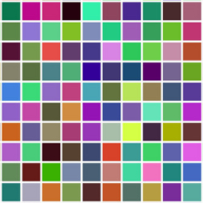

# js-test

### On load:
Using plain vanilla javascript create square div containerSize * containerSize

1. Create inside it numberOfChildren square elements which:
    - do no overlap each other
    - are fully contained within the container div
    - do not stretch container and not showing scroll 
    - has size childSize * childSize (squares)
    - has random background color
    - when you hover it longer than 2 seconds it disappears
2. In case container cannot fit numberOfChildren:
    - render as much children as container can fit and show message for user about actual rendered number of children inside container.
3. When hover over the children squares they should change background colors randomly

### Options to test if it appears correctly

* drawContainer(310, 200, 4);
* drawContainer(413, 42, 30);
* drawContainer(200, 300, 2);

### Expected result must be similar to this

